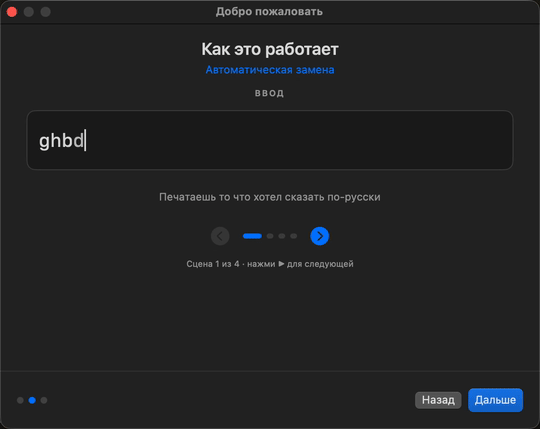
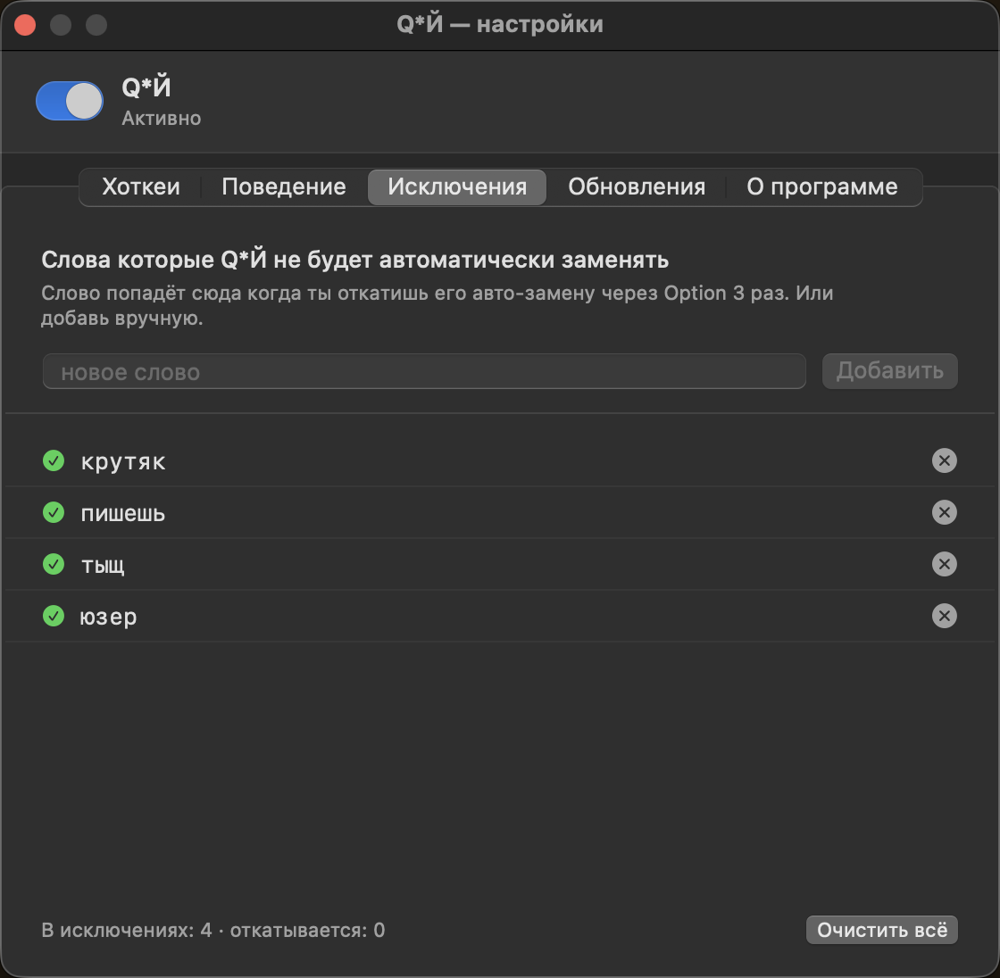

# Q*Й

Умный переключатель раскладок для macOS на Apple Silicon. Замечает когда ты печатаешь в неправильной раскладке (например `ghbdtn` вместо `привет`), сам всё переписывает и переключает раскладку — продолжаешь печатать как ни в чём не бывало.

[English version below](#english) · [Скачать](https://github.com/graninilya/keyswitcher/releases/latest)

---

## Возможности

- **Автоматическая замена** — печатаешь слово в неправильной раскладке, ставишь пробел, оно само превращается в правильное.
- **Умный детектор** — анализирует распределение символов, не трогает валидные слова и редкие имена.
- **Контекст** — смотрит на соседние слова. Одиночные буквы-предлоги (`f`, `b`) тоже исправляются если контекст это требует.
- **Откат в одно нажатие** — если автозамена ошиблась, нажми **Option** в течение 5 секунд и текст вернётся как был.
- **Замена выделенного** — выдели уже набранный кусок (мышкой, Shift+стрелка или Cmd+A) и нажми **Option** — переведёт только выделение.
- **Транслитерация** (**⌥⇧T**) — кириллица в латиницу по ГОСТ 7.79: «Иванов» → «Ivanov». Удобно для документов и форм.
- **Принудительный свап** (**⌥⇧S**) — без проверки детектором, всегда меняет раскладку выделения или последнего слова.
- **Тихие автообновления** — новые версии приходят сами, без походов на сайт.
- **Безопасно** — приложение отключается само в полях паролей.

---

## Установка

1. Скачай последний `.dmg` со страницы [Releases](https://github.com/graninilya/keyswitcher/releases/latest).
2. Открой DMG, перетащи **Q*Й.app** в папку **Программы**.
3. **Первый запуск:** клик правой кнопкой по приложению → **Открыть** → подтверди в диалоге macOS.
4. Дай разрешение на **Универсальный доступ (Accessibility)**: Системные настройки → Конфиденциальность и безопасность → Универсальный доступ → добавь Q*Й.
5. Появится экран приветствия с обучением. Готово.

Все обновления после этого приходят прозрачно через меню **«Проверить обновления…»**.

---

## Хоткеи по умолчанию

| Хоткей | Действие |
|---|---|
| **левый Option** | Сменить раскладку выделения / последнего слова. Повторное нажатие в 5 сек — откат. |
| **⌥⇧S** | Принудительно сменить раскладку (без проверки). |
| **⌥⇧T** | Транслитерация выделения: кириллица → латиница. |

Все хоткеи можно переназначить в **Настройках → Хоткеи**.

---

## Исключения — обучается под тебя

Иногда детектор ошибается и заменяет нужное слово (редкий сленг, фамилию, термин). Q*Й запоминает такие случаи и больше их не трогает.

**Как это работает:**

1. Печатаешь слово, Q*Й заменил его автоматически
2. Жмёшь **Option** в течение 5 секунд → откатил замену
3. Откатил **3 раза подряд** (для разных вхождений того же слова) → слово навсегда добавляется в исключения
4. В **Настройках → Исключения** видно весь список — можно вручную добавлять и удалять

**Зачем 3 раза, а не 1?** Чтобы случайный откат не записал в исключения слово которое ты на самом деле хотел заменить. После третьего раза Q*Й уверен что это не ошибка.

**Что внутри**:
- ✓ зелёные — финальные исключения, больше не свапаются
- ⏱ оранжевые — слова которые ты откатывал, но ещё не дошёл до 3-го раза. Счётчик `1 / 3`, `2 / 3` показывает сколько осталось.

---

## Системные требования

- macOS 13.0 (Ventura) или новее
- Apple Silicon (M1/M2/M3/M4)

---

## Приватность

- Всё обрабатывается **локально**. Никакие нажатия не уходят в сеть.
- Обновления проверяются через публичный GitHub Releases — без телеметрии.
- Буфер клавиш хранит только последнее набираемое слово в оперативке; в полях паролей буфер выключен полностью.

---

## Лицензия

MIT — свободно использовать, изменять и распространять. Текст — [LICENSE](LICENSE).

---

## English

Smart keyboard layout switcher for macOS on Apple Silicon. Notices when you've typed in the wrong layout (for example `ghbdtn` instead of `привет`), rewrites the word, and switches the system input source so you keep typing in the right layout.

### Features

- **Auto-conversion on the fly** — type a word in the wrong layout, hit space, it fixes itself.
- **Smart detector** — analyses character statistics; valid words and rare names are left alone.
- **Context aware** — looks at surrounding words. Single-letter prepositions (`f`, `b`) get fixed too when context demands.
- **One-tap undo** — if the auto-fix was wrong, press **Option** within 5 seconds to restore the original.
- **Convert selection** — select already-typed text (mouse, Shift+arrow, or Cmd+A) and press **Option** — only the selection is converted.
- **Transliteration** (**⌥⇧T**) — Cyrillic → Latin per GOST 7.79: «Иванов» → «Ivanov». Handy for paperwork and forms.
- **Force swap** (**⌥⇧S**) — bypasses the detector, always swaps the layout of the selection or last word.
- **Silent auto-updates** — new versions arrive without you visiting the site.
- **Safe** — the app turns itself off inside password fields.

### Install

1. Download the latest `.dmg` from [Releases](https://github.com/graninilya/keyswitcher/releases/latest).
2. Open the DMG, drag **Q*Й.app** into **Applications**.
3. **First launch:** right-click the app → **Open** → confirm the macOS dialog.
4. Grant **Accessibility** permission: System Settings → Privacy & Security → Accessibility → add Q*Й.
5. A welcome screen with a quick tour appears. You're set.

All later updates arrive transparently via **"Check for updates…"** in the menu.

### Default hotkeys

| Hotkey | Action |
|---|---|
| **left Option** | Convert selection / last word. Pressing again within 5s reverts. |
| **⌥⇧S** | Force-convert (no detector check). |
| **⌥⇧T** | Transliterate selection: Cyrillic → Latin. |

Rebind anything in **Settings → Hotkeys**.

### Exceptions — adapts to you

The detector is wrong sometimes (rare slang, surnames, technical terms). Q*Й remembers these and stops touching them.

**How it works:**

1. Type a word, Q*Й auto-converts it.
2. Press **Option** within 5 seconds to revert.
3. Revert **three times** for the same word and it's permanently added to exceptions.
4. **Settings → Exceptions** shows the full list — add or remove manually.

**Why three reverts, not one?** A single accidental revert shouldn't blacklist a word you actually wanted converted. After three the app is sure it's not a fluke.

### Requirements

- macOS 13.0 (Ventura) or later
- Apple Silicon (M1/M2/M3/M4)

### Privacy

- Everything runs **locally**. No keystrokes leave your machine.
- Update checks go through public GitHub Releases — no telemetry.
- The keystroke buffer keeps only the most recent word in process memory; password fields are skipped entirely.

### License

MIT — free to use, modify, and redistribute. See [LICENSE](LICENSE).
